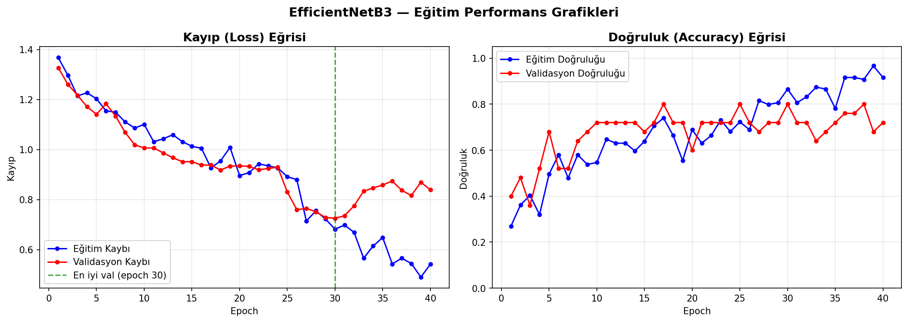
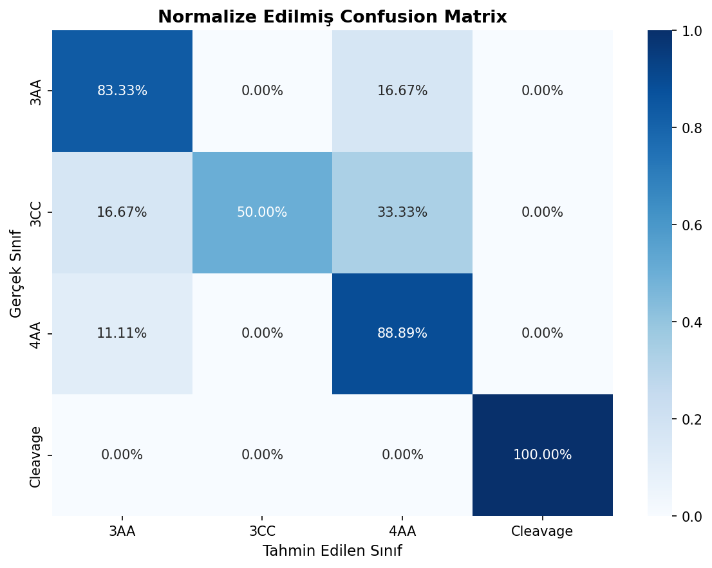
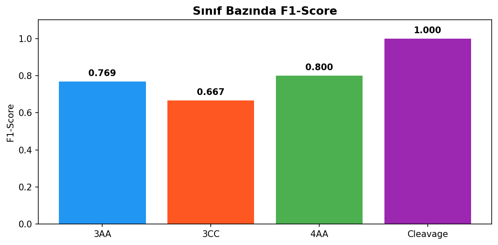
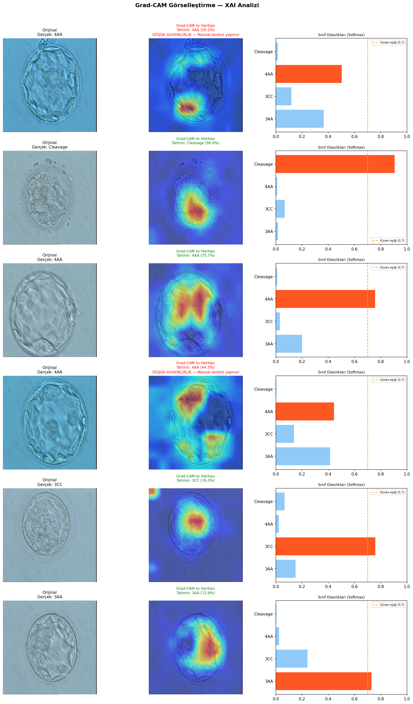
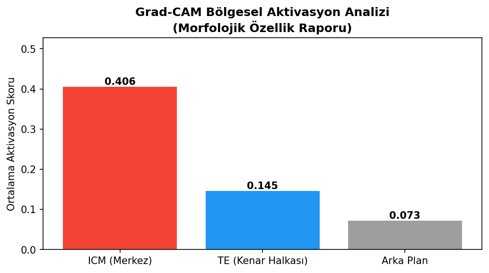

# DeepEmbryo: 5. Gün Embriyo Kalite Değerlendirme Sistemi

> EfficientNetB3 tabanlı derin öğrenme modeli ile IVF tedavisindeki blastosist embriyolarının Gardner skalasına göre otomatik sınıflandırılması.

---

## Model Performansı

| Sınıf | F1-Score | Açıklama |
|-------|----------|----------|
| 3AA | 0.769 | İyi kalite, 3. gün genişleme |
| 3CC | 0.667 | Düşük kalite — morfolojik benzerlik nedeniyle en zor sınıf |
| 4AA | 0.800 | İyi kalite, 4. gün genişleme |
| Cleavage | 1.000 | Erken evre embriyo |
| **Weighted Avg** | **0.801** | |
| **Test Accuracy** | **%80.77** | |

### Accuracy - Loss Eğrisi
<!-- accuracy_loss_curves.png dosyasını buraya ekle -->


### Confusion Matrix
<!-- confusion_matrix_normalized.png dosyasını buraya ekle -->


### F1-Score Per Class
<!-- f1_per_class.png dosyasını buraya ekle -->


### Grad-CAM XAI Analizi
<!-- gradcam_results.png dosyasını buraya ekle -->


### Morfolojik Özellik Raporu
<!-- morphological_feature_report.png dosyasını buraya ekle -->


---

## Proje Yapısı

```
├── assets/
│   ├── best_model.pth          # Eğitilmiş model ağırlıkları (git'e dahil değil)
│   └── model_info.json         # Model metadata
├── model/
│   ├── config.py               # Tüm sabitler ve hiperparametreler
│   ├── model.py                # EfficientNetB3 tanımı ve yükleme
│   ├── dataset.py              # Veri yükleme, augmentation, DataLoader
│   ├── train.py                # Eğitim döngüsü, early stopping
│   └── evaluate.py             # Metrikler, confusion matrix, grafikler
├── services/
│   ├── inference_service.py    # Tekli/batch tahmin servisi
│   ├── gradcam_service.py      # Grad-CAM ısı haritası servisi
│   └── report_service.py       # CSV/JSON rapor üretimi
└── requirements.txt
```

---

## Model Detayları

| Parametre | Değer |
|-----------|-------|
| Mimari | EfficientNetB3 (Transfer Learning) |
| Ön Eğitim | ImageNet |
| Input Boyutu | 300×300 px |
| Optimizer | AdamW |
| Kayıp Fonksiyonu | CrossEntropyLoss (Label Smoothing=0.1) |
| Sınıf Ağırlıkları | [1.0, 2.0, 1.5, 1.0] |
| Dropout | 0.6 |
| Early Stopping | 10 epoch |
| Unfreeze Epoch | 25 |
| Güven Eşiği | 0.70 |

### Veri Seti

| Split | Oran | Görsel Sayısı |
|-------|------|---------------|
| Eğitim | %70 | ~119 |
| Validasyon | %15 | ~25 |
| Test | %15 | ~26 |

**Augmentation:** Yatay/dikey flip, ±30° rotasyon, parlaklık/kontrast jitter, affine translate.  
**Örnekleme:** WeightedRandomSampler (az örnekli sınıfları dengeler).

---

## Kurulum

```bash
pip install -r requirements.txt
```

`best_model.pth` dosyasını `assets/` klasörüne ekle.

> **Model dosyasını indir:** [best_model.pth (41MB)](https://drive.google.com/file/d/15iAFTBtFB0FYFVkSjZleNtESMTi4kQtM/view?usp=sharing)

---

## Kullanım

### Tekli Tahmin

```python
from services.inference_service import InferenceService

service = InferenceService('assets/best_model.pth')
result  = service.predict('embriyo.jpg')

print(result['prediction'])   # '4AA'
print(result['confidence'])   # 0.8119
print(result['warning'])      # False
print(result['warning_msg'])  # ''
```

### Grad-CAM Isı Haritası

```python
from services.gradcam_service import GradCAMService

cam    = GradCAMService('assets/best_model.pth')
result = cam.generate('embriyo.jpg')

# Web için base64 PNG
print(result['cam_image_b64'])

# Bölgesel aktivasyon (ICM / TE / Arka Plan)
print(result['region_scores'])
```

### Batch Tahmin + Rapor

```python
from services.inference_service import InferenceService
from services.report_service import ReportService

inference = InferenceService('assets/best_model.pth')
report    = ReportService()

paths = ['e1.jpg', 'e2.jpg', 'e3.jpg']
for path in paths:
    result = inference.predict(path)
    result['filename'] = path
    report.add_result(result)

report.export_csv('outputs/rapor.csv')
report.export_json('outputs/rapor.json')
print(report.get_summary())
```

---

## XAI (Açıklanabilir Yapay Zeka)

### Grad-CAM Görsel Kanıt
Her tahmin için modelin embriyonun hangi bölgesine odaklandığı ısı haritasıyla gösterilir.

### Uyarı Sistemi
Softmax güven skoru **0.70'in altında** olan tahminlerde kullanıcıya uyarı verilir:
> "Bu tahmin düşük güvenilirliktedir, lütfen manuel kontrol yapınız."

### Morfolojik Özellik Raporu
Grad-CAM aktivasyonları 3 bölgeye ayrılarak analiz edilir:
- **ICM (Merkez):** İç hücre kütlesi — bebeğe dönüşecek bölge
- **TE (Kenar Halkası):** Trofektoderm — plasentaya dönüşecek bölge  
- **Arka Plan:** Blastosist dışı alan

Mevcut modelde dominant bölge: **ICM (0.406)** — Gardner sınıflandırmasıyla uyumlu.

---

## Referanslar

- Gardner & Schoolcraft (1999). *Culture and transfer of human blastocysts.*
- Tan et al. (2019). *EfficientNet: Rethinking Model Scaling for Convolutional Neural Networks.*
- Selvaraju et al. (2017). *Grad-CAM: Visual Explanations from Deep Networks.*